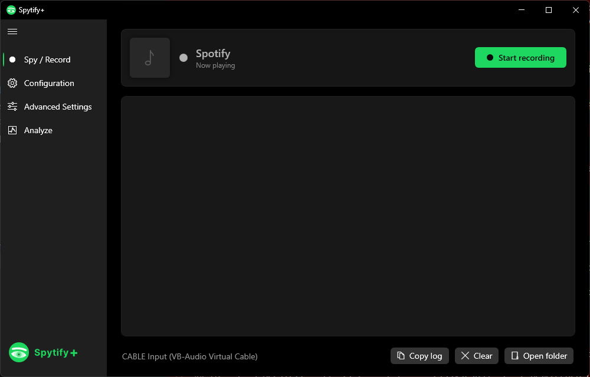
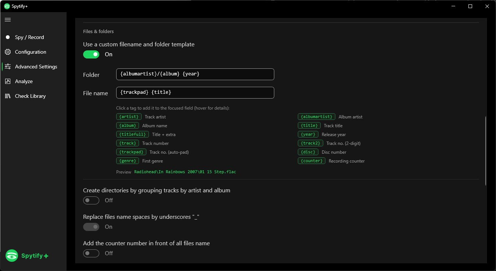
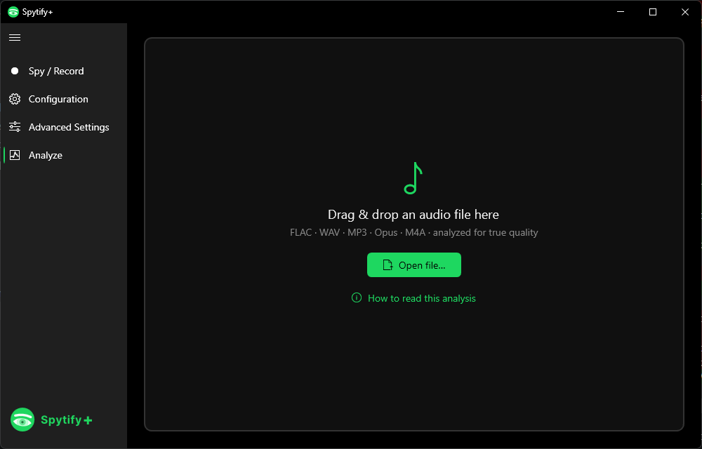

# Spytify+

**Spytify+** is a Windows recorder that captures Spotify to a clean, tagged, offline music library. It records what Spotify plays out (WASAPI loopback), skips ads, splits songs into separate tracks, and writes full metadata and cover art. FLAC is a first-class format, and with Spotify Lossless plus a matched sample rate the capture can be bit-perfect.

[](LICENSE)


> This is a fork. Spytify+ builds on [`Fora888/spytify-flac`](https://gitlab.com/Fora888/spytify-flac) (which added FLAC), itself a fork of the original [Spytify by jwallet](https://github.com/jwallet/spy-spotify). All three are MIT-licensed. See [Credits](#credits).

## Screenshots

<p align="center">
  
</p>
<p align="center">
  
  
</p>

## How it works

Spytify+ records the decoded audio at the Windows audio device, so the captured quality is exactly what Spotify plays back. It is not a downloader: it listens in real time, detects track changes, and saves each song as its own file with metadata from Last.fm or the Spotify API.

Because it captures the playback path, the audio ceiling is whatever Spotify outputs:

- **Spotify "Very High" (320 kbps Ogg)** → a FLAC recording is a lossless wrapper around 320-quality audio (a ~20 kHz brick wall in a spectrogram). Clean, but not lossless music.
- **Spotify Lossless (Premium, 16/24-bit 44.1 kHz)** → the capture can be **bit-perfect** if the Windows/virtual-cable output is set to **44.1 kHz** so nothing resamples.

The philosophy is pure capture: Spytify+ mirrors Spotify's output faithfully and never resamples, transcodes, or applies loudness processing to the audio.

## What's new in Spytify+

On top of the FLAC fork, Spytify+ adds:

**Recording UI**
- A modern WPF interface (Fluent, Spotify-green), English + French.
- A mini Spotify-style **player card** on the Record screen showing the current track's album art live.
- An **Analyze** tab: drop any audio file to see a spectral quality verdict (real bitrate, lossy brick-wall cut-off, and lossy-in-a-lossless-container transcode detection).

**Song metadata & organisation**
- **Custom filename & folder templates** (opt-in) with a click-to-insert tag builder: `{artist} {albumartist} {album} {title} {titlefull} {year} {track} {track2} {disc} {genre} {counter}`.
- **Record the current playlist as one album** (Spotify API): tags a whole playlist as a single compilation, using the playlist name, its cover art, and "Various Artists".
- **ISRC + Spotify track/album ID tags** for de-duping and re-linking (Spotify API).
- **Save the album cover as `cover.jpg`** in each album folder.
- **Export an `.m3u` playlist** per folder (mirrors a recorded Spotify playlist as a portable playlist).
- FLAC/OPUS now honour the tag toggles (extra-title-as-subtitle, counter-as-track-number, re-tag on replay) just like MP3/WAV.

**Recording integrity**
- **Discard truncated recordings**: drops captures cut clearly short of the track's real length.
- **Analyze each recording** and log its real quality automatically.

**Library maintenance (Check Library tab)**
- **Analyse Library**: sweep a whole folder of existing recordings and grade each file's real quality in one batch, flagging anything that isn't what it claims (quality-tier and "no match" badges).
- **Update Library Metadata**: refresh tags and cover art straight from Spotify, matched exactly by each file's embedded **ISRC** so it can never mistag (files without an ISRC are skipped and counted). No playback or re-recording; needs the Spotify API connected.

**Formats:** FLAC, OPUS, MP3, WAV.

## Requirements

- Windows.
- [.NET Framework 4.8](https://dotnet.microsoft.com/download/dotnet-framework/net48) runtime.
- The Spotify desktop app.
- A **free Spotify account works** (capped at 160 kbps); Premium enables 320 kbps, and Premium Lossless enables CD-quality capture.

For best results, record through a virtual audio cable (e.g. VB-Audio) set to 44.1 kHz, and use the **Spotify API** metadata source. Some features (playlist-as-album, ISRC/Spotify-ID tags) require it; see [Spotify API setup](#spotify-api-setup) below.

## Spotify API setup

Spytify+ works out of the box using Last.fm for metadata. To unlock the features that use the **Spotify Web API** (more accurate tags, "record the current playlist as one album", and ISRC / Spotify-ID tagging), set up your own free Spotify API app and enter the keys in Spytify+:

1. Open the [Spotify Developer Dashboard](https://developer.spotify.com/dashboard) and log in.
2. **Create an app** (any name and description). In its settings, add a **Redirect URI**, then copy the **Client ID** and **Client Secret**.
3. In Spytify+, go to **Configuration**, choose the **Spotify API** metadata source, paste the Client ID and Client Secret, and set the **same Redirect URI** you used in the dashboard (Spytify+ defaults to `http://127.0.0.1:8000`; Spotify no longer accepts `localhost`, so use the `127.0.0.1` loopback IP). Click **Connect to Spotify** and authorize.

Spytify+ only reads track metadata through the API and records the audio playback; it never downloads files from Spotify, so it stays within what the desktop app already plays.

## Installing & running (Windows SmartScreen)

Spytify+ is **not code-signed** (a signing certificate is a paid yearly cost for a free, open-source tool). So the first time you run it, Windows **SmartScreen** shows a blue **"Windows protected your PC"** dialog listing an *unknown publisher*. This is the standard warning for any small unsigned app, not Windows detecting anything malicious in Spytify+ itself.

To run it:

1. Click **More info** on the SmartScreen dialog.
2. Click **Run anyway**.

If you downloaded the release **`.zip`**, Windows may mark it as "blocked" (mark-of-the-web), which carries over to the extracted files. Before extracting: right-click the **`.zip` → Properties → tick "Unblock" → OK** (or do the same on `Spytify.exe` after extracting).

The warning also fades on its own over time: SmartScreen builds a reputation score per file, and once enough people have downloaded and run a given release without issues, it stops flagging it. Early adopters see the prompt; later ones usually don't.

Prefer not to trust a download at all? **Build it yourself from source** (below). It's the same app.

## Building from source

The engine still uses `packages.config`, so build with **Visual Studio's MSBuild** (not `dotnet build`):

```powershell
# Restore
& "<VS>\MSBuild\Current\Bin\MSBuild.exe" EspionSpotify.sln -t:Restore -p:RestorePackagesConfig=true
# Build
& "<VS>\MSBuild\Current\Bin\MSBuild.exe" EspionSpotify.sln -p:Configuration=Release -m
```

Output: `EspionSpotify.Wpf/bin/Release/net48/Spytify.exe`.

Run the tests with `vstest.console.exe EspionSpotify.Tests/bin/Release/EspionSpotify.Tests.dll`.

Projects: `EspionSpotify` (engine, `EspionSpotify.dll`), `EspionSpotify.Wpf` (the shipped `Spytify.exe`), `EspionSpotify.Updater`, and `EspionSpotify.Tests`.

## Credits

Spytify+ stands on the work of others, all MIT-licensed:

- **[Spytify](https://github.com/jwallet/spy-spotify) by jwallet**: the original Spotify recorder. Most of the recording engine and the general FAQ come from here.
- **[spytify-flac](https://gitlab.com/Fora888/spytify-flac) by Fora888**: added native FLAC output.
- **Spytify+**: the WPF rewrite, offline-library features, and quality tooling in this repo.

For setup basics (installing a virtual audio cable, isolating Spotify's audio, connecting the Spotify API), the upstream [Spytify FAQ](https://jwallet.github.io/spy-spotify/faq.html) still applies.

## Support

😃 If you like Spytify+, you can help the original author **jwallet** out for a [couple of beers](https://jwallet.github.io/spy-spotify/donate.html) 🍺, and give this repo a star ⭐

## License

[MIT](LICENSE). See [Credits](#credits).
